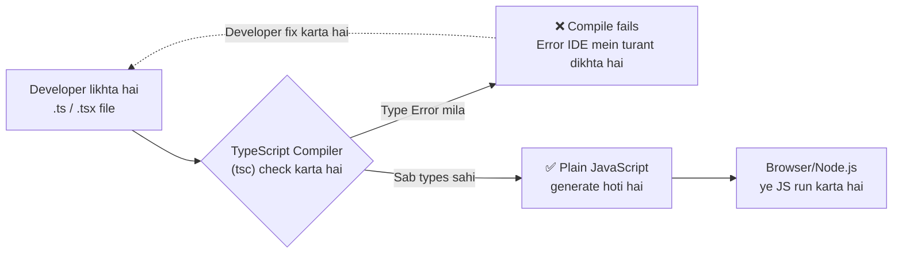
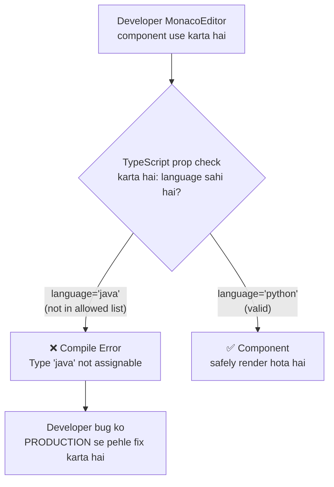
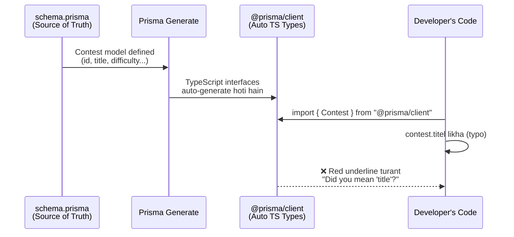
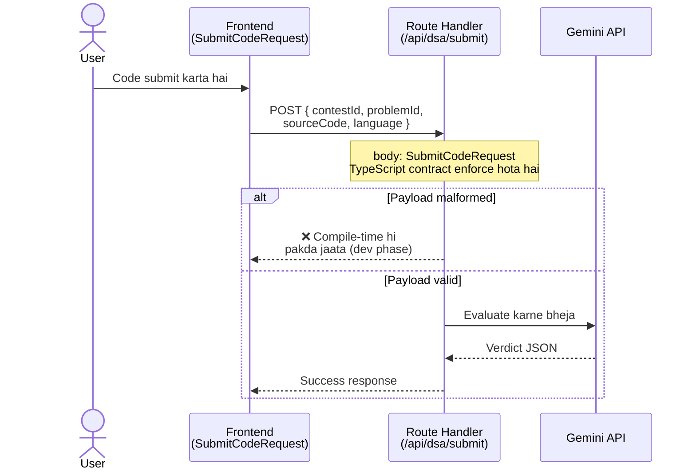
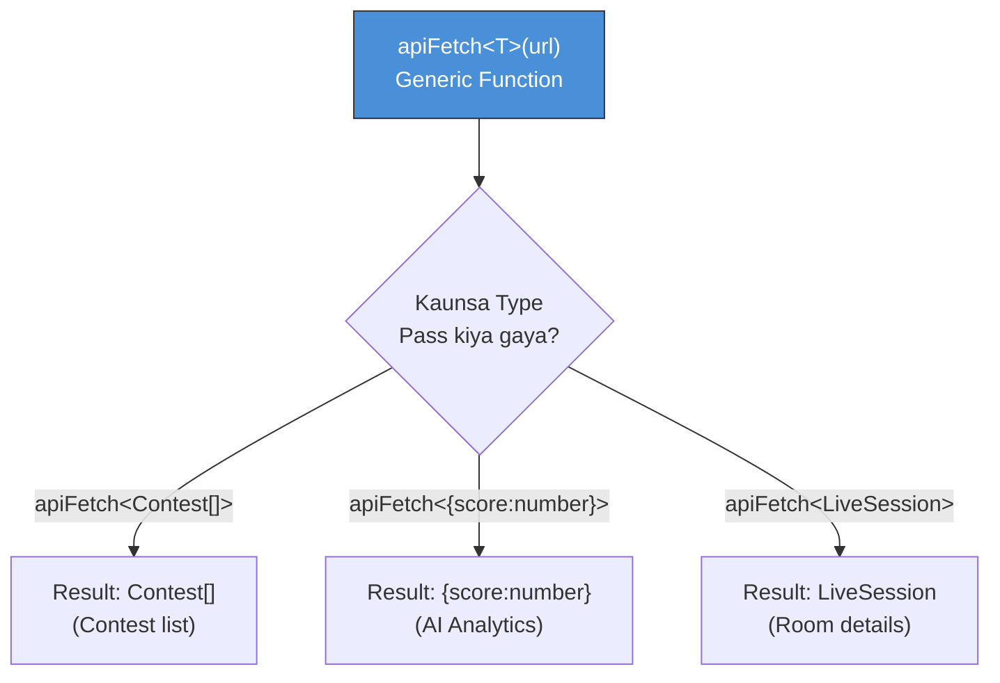
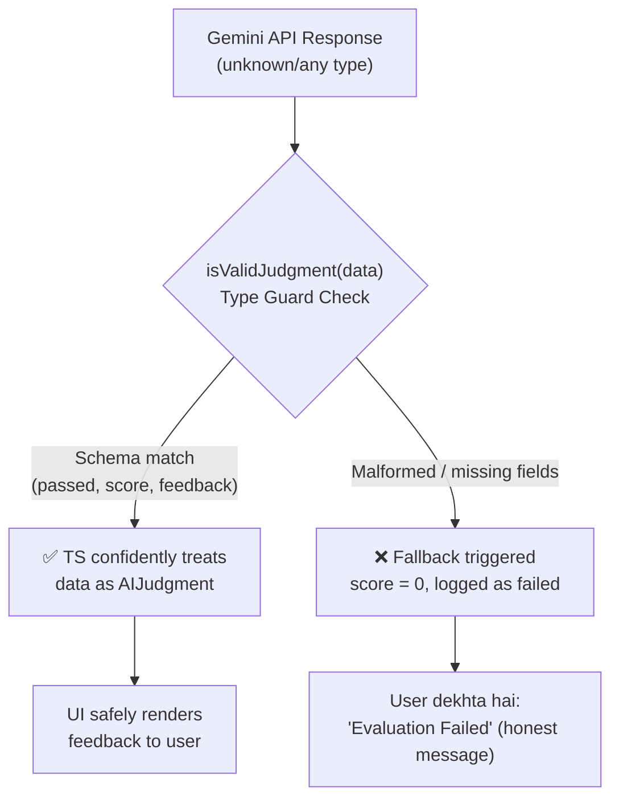
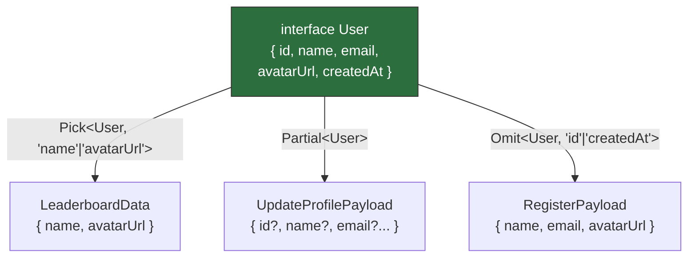
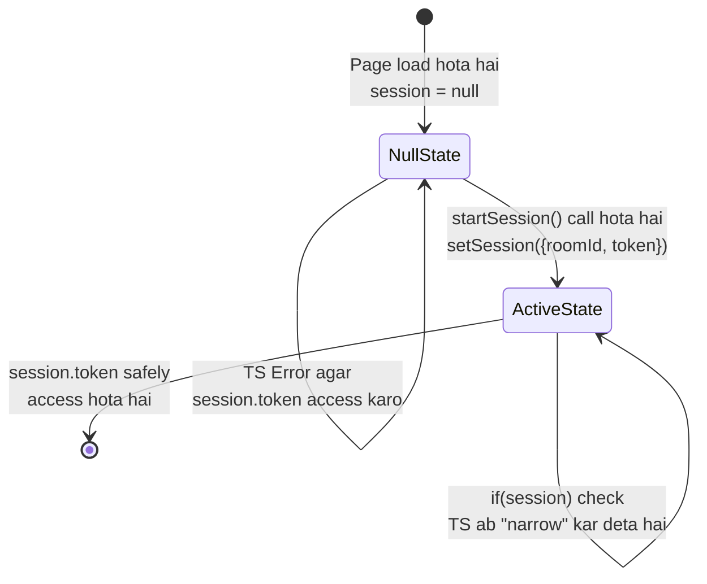
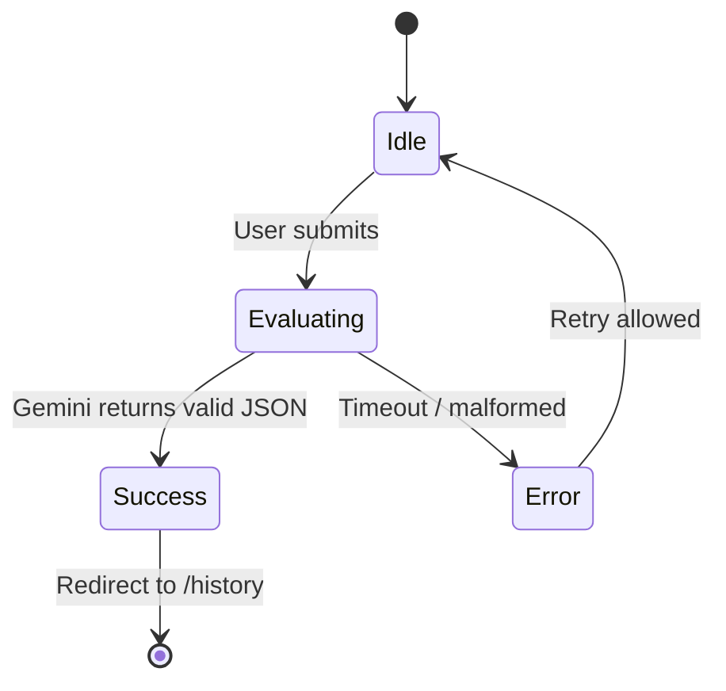
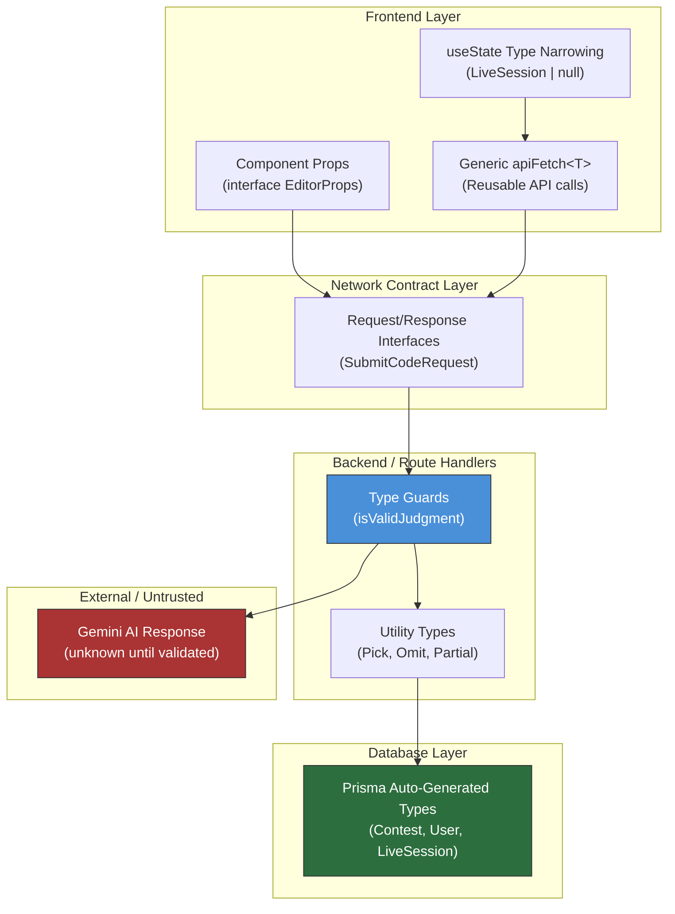

# CodeSaarthi — Complete TypeScript Guide (with Diagrams)
### Har Concept: Diagram + Real Code + Real-Life Scenario + "Website pe kya Enable karta hai"

---

## 0. TypeScript Kya Hai Aur Kaam Kaise Karta Hai (Foundation)

**Simple Definition:** TypeScript = JavaScript + Type Checking Layer. Browser TypeScript ko samajhta hi nahi — compile-time pe TS Compiler (`tsc`) usse plain JavaScript mein convert karta hai, aur isi process ke beech mein saari galtiyan pakad leta hai.



**Real-Life Scenario:** Socho tum ek restaurant mein order le rahe ho. JavaScript waiter kisi bhi cheez ka order le lega — "mujhe ek chair do khaane ke liye" bhi accept kar lega, aur kitchen mein jaake crash ho jaayega. TypeScript waiter **order lene se pehle hi menu check karta hai** — "chair" menu mein hai hi nahi, order reject.

**Website pe kya Enable karta hai:** Production mein deploy hone se **pehle hi** (build step pe) 90% bugs pakde jaate hain — jo bug production mein user ko crash dikhata, wo ab tumhare VS Code mein red-underline ban jaata hai.

---

## 1. Component Props Typing (The UI Guard)

**Dard:** CodeSaarthi mein Code Editor component hai. Bina type-checking ke, koi bhi galat `language` ya missing `code` pass karke UI crash kar sakta hai.



### Real Code Example

```typescript
interface EditorProps {
  code: string;
  language: "javascript" | "python" | "cpp"; // Sirf yahi 3 allow hain
  theme?: string; // "?" matlab optional
}

export function MonacoEditor({ code, language, theme = "vs-dark" }: EditorProps) {
  return (
    <div>
      <h3>Running {language.toUpperCase()} Editor</h3>
      <pre>{code}</pre>
    </div>
  );
}

// Galti pakdi gayi:
// <MonacoEditor code="print(1)" language="java" /> 
// ^ TS Error: Type '"java"' is not assignable to "javascript" | "python" | "cpp"
```

**Real-Life Scenario:** Ye bilkul waise hai jaise ek ATM machine — tum sirf "Withdraw", "Deposit", "Balance Check" hi choose kar sakte ho, koi 4th random option ATM screen pe hai hi nahi. Interface **allowed actions ko design-level pe hi lock kar deta hai.**

**Website pe kya Enable karta hai:**
- Naya developer team mein join kare, wo `<MonacoEditor` type karte hi IDE **autocomplete** dikhayega ki kaunse props chahiye
- `language="Java"` (capital J typo) jaisi silly mistakes production mein kabhi nahi jaayengi
- Contest ke time editor crash hone ka risk **zero** ho jaata hai kyunki bina valid props ke component render hi nahi ho sakta

---

## 2. Auto-Generated Database Types via Prisma (The Core DB)

**Dard:** Backend developer ko yaad nahi rehta ki DB column `email` hai ya `user_email`, `createdAt` `Date` hai ya `string`.



### Real Code Example

```typescript
import { prisma } from "@/lib/db";
import { Contest } from "@prisma/client"; // Auto-generated by Prisma!

async function getContestDetails(contestId: string): Promise<Contest | null> {
  const contest = await prisma.contest.findUnique({
    where: { id: contestId }
  });
  // contest.titel likhu (spelling mistake) -> TS turant red line dikhayega
  return contest; 
}
```

**Real-Life Scenario:** Jaise Aadhar Card ka centralized database hai — har government office same format follow karta hai kyunki wo ek hi source se data khींchte hain. Prisma schema tumhara "Aadhar system" hai — database aur code kabhi out-of-sync nahi ho sakte.

**Website pe kya Enable karta hai:**
- `ContestAttempt`, `Blog`, `LiveSession` — teeno models 100% synchronized rehte hain schema ke saath
- Database migration (naya column add) karte hi, poori codebase mein IDE turant naya field suggest karne lagta hai — koi manual sync nahi
- Backend development **kaafi fast** ho jaata hai kyunki autocomplete se pata chal jaata hai available fields kya hain

---

## 3. Strict API Requests & Responses (Network Safety)

**Dard:** Frontend se backend tak data jaata hai bina kisi "contract" ke — backend ko pata hi nahi chalta ki request body mein kya expect karna hai.



### Real Code Example

```typescript
interface SubmitCodeRequest {
  contestId: string;
  problemId: string;
  sourceCode: string;
  language: string;
}

export async function POST(req: Request) {
  const body: SubmitCodeRequest = await req.json();
  console.log(`Evaluating code for contest: ${body.contestId}`);
}
```

**Real-Life Scenario:** Jaise courier company ka fixed form hota hai — "Sender Name, Receiver Address, Weight, Pincode" — bina in fields ke parcel accept hi nahi hota counter pe. Interface ye **form template** hai jo frontend aur backend dono follow karte hain.

**Website pe kya Enable karta hai:**
- Frontend aur backend team alag-alag kaam kar sakti hain bina baar-baar confirm kiye "field ka naam kya hai" — interface hi documentation ban jaata hai
- API mein galat shape ka data jaane se **development phase mein hi** rok diya jaata hai
- Contest submission jaisa critical flow kabhi silently corrupt data receive nahi karta

---

## 4. API Fetch Wrapper using Generics (Reusable Logic)

**Dard:** Har API call ke liye alag-alag `fetch()` + `res.json()` + manual typing likhna — duplicate, boring code.



### Real Code Example

```typescript
async function apiFetch<T>(url: string): Promise<T> {
  const response = await fetch(url);
  if (!response.ok) throw new Error("API failed");
  return response.json() as Promise<T>;
}

// Use case 1:
const contests = await apiFetch<Contest[]>("/api/contests"); 
// Use case 2:
const analysis = await apiFetch<{ score: number }>("/api/ai-judge");
```

**Real-Life Scenario:** Ye ek **universal charger** ki tarah hai — ek hi charger (function) alag-alag device (types) ko charge kar sakta hai bina alag-alag charger banaye. `<T>` ek "placeholder plug" hai jo har baar apni shape adjust kar leta hai.

**Website pe kya Enable karta hai:**
- Poore project mein sirf **ek hi** fetch function maintain karna padta hai — 15+ API endpoints ke liye 15+ alag functions nahi likhne padte
- Naya API endpoint add karna 30-second ka kaam ban jaata hai: `apiFetch<NewType>("/api/new-route")`
- Code review mein bugs kam milte hain kyunki duplicate logic hi nahi hai jo har jagah alag tarah se galat ho sake

---

## 5. Type Guards for Untrusted AI Responses (Gemini Integration)

**Dard:** Gemini AI kabhi-kabhi malformed ya unexpected JSON return kar sakta hai — TypeScript `any`/`unknown` bolke seedha trust nahi karta.



### Real Code Example

```typescript
interface AIJudgment {
  passed: boolean;
  score: number;
  feedback: string;
}

function isValidJudgment(data: any): data is AIJudgment {
  return (
    typeof data === "object" &&
    typeof data.passed === "boolean" &&
    typeof data.score === "number"
  );
}

const aiRawResponse = await callGeminiAPI(code); 

if (isValidJudgment(aiRawResponse)) {
  console.log(aiRawResponse.feedback); 
} else {
  console.log("AI returned malformed JSON!");
}
```

**Real-Life Scenario:** Jaise bank cheque clear karne se pehle signature verify karta hai — cheque "dikhta" to valid hai, lekin verification (type guard) ke bina blindly paisa release nahi karte. Agar signature match na kare, transaction reject (fallback score = 0).

**Website pe kya Enable karta hai:**
- Gemini kabhi crash-prone response de, poora contest-evaluation flow crash nahi hota — gracefully `0` score fallback hota hai
- Users ko kabhi bhi ek **exploitable "free pass"** score nahi milta agar AI fail ho jaaye (security angle)
- Poori app **AI ki unpredictability se insulate** ho jaati hai — untrusted external data safely handle hoti hai

---

## 6. TypeScript Utility Types: Partial, Pick, Omit (Zero Code Duplication)

**Dard:** Har screen (Signup, Leaderboard, Edit Profile) ke liye alag-alag `User` interface banana repetitive hai.



### Real Code Example

```typescript
interface User {
  id: string;
  name: string;
  email: string;
  avatarUrl: string;
  createdAt: Date;
}

type LeaderboardData = Pick<User, "name" | "avatarUrl">;
type UpdateProfilePayload = Partial<User>;
type RegisterPayload = Omit<User, "id" | "createdAt">;
```

**Real-Life Scenario:** Ek hi **Aadhar card** (base `User`) se alag-alag documents banate ho — Passport ke liye kuch fields chahiye (`Pick`), Voter ID ke liye kuch aur (`Omit`) — lekin source data ek hi hai, baar-baar naya form nahi bharte.

**Website pe kya Enable karta hai:**
- Leaderboard page sirf `name` + `avatarUrl` render karega — poora `User` object (email samet) leak nahi hoga frontend pe (privacy bhi improve hoti hai)
- Profile edit form mein user sirf `name` change kare to poora object bhejne ki zaroorat nahi
- Signup form automatically **sync rehta hai** `User` model ke saath — agar kal `phoneNumber` field add ho, `RegisterPayload` automatically update ho jaayega

---

## 7. State Management with Type Narrowing (useState)

**Dard:** Live session start hone se pehle state `null` hai, start hone ke baad object — bina check kiye crash: `Cannot read properties of null`.



### Real Code Example

```typescript
interface LiveSession {
  roomId: string;
  token: string;
}

function LiveRoom() {
  const [session, setSession] = useState<LiveSession | null>(null);

  return (
    <div>
      {session ? (
        <VideoPlayer token={session.token} />
      ) : (
        <button onClick={startSession}>Join Live Stream</button>
      )}
    </div>
  );
}
```

**Real-Life Scenario:** Flight boarding gate — jab tak boarding pass scan (session valid) nahi hota, gate khulta hi nahi (VideoPlayer render nahi hota). Security check (`if(session)`) pass kiye bina aage jaana possible hi nahi hai.

**Website pe kya Enable karta hai:**
- LiveKit video room kabhi bhi `null` token ke saath connect karne ki koshish nahi karega — connection crash impossible ban jaata hai
- Developer ko manually `if (session === null) return` jaise defensive checks yaad nahi rakhne padte — TypeScript khud force karta hai
- Real-time mentorship sessions **production-grade stable** rehti hain kyunki race-condition wale null-access bugs compile-time pe hi khatam ho jaate hain

---

## 8. Discriminated Unions — Contest Evaluation State Machine

**Bonus concept jo document mein nahi tha, lekin CodeSaarthi ke evaluation flow ke liye critical hai.**



### Real Code Example

```typescript
type EvalState =
  | { status: 'idle' }
  | { status: 'evaluating' }
  | { status: 'success'; data: { correct: number; total: number; accuracy: number } }
  | { status: 'error'; message: string };

function renderResult(state: EvalState) {
  if (state.status === 'success') {
    return `Accuracy: ${state.data.accuracy}%`; // TS jaanta hai 'data' exists
  }
  if (state.status === 'error') {
    return `Failed: ${state.message}`; // TS jaanta hai 'message' exists
  }
  return 'Loading...';
}
```

**Real-Life Scenario:** Traffic signal — Red, Yellow, Green — ek time pe sirf ek hi state active ho sakti hai, aur har state ka apna fixed "meaning" hai (Red = rukna, Green = jaana). Tum kabhi "Red aur Green dono active" wali invalid state nahi bana sakte.

**Website pe kya Enable karta hai:**
- Contest submission flow mein `isLoading=true` aur `isError=true` **ek saath** hone jaisi buggy states **impossible** ban jaati hain
- `/history` dashboard, Recharts analytics — sab predictable, finite states follow karte hain, koi "undefined behavior" nahi

---

## 🗺️ Master Diagram — Poora TypeScript Ecosystem CodeSaarthi Mein



**Is diagram ka matlab:** TypeScript ek single, unbroken chain banata hai — Database (Prisma) se lekar UI Component tak, har layer pe type-safety guaranteed hai. Sirf **ek jagah** (Gemini AI response) jaha external/untrusted data aata hai, wahi Type Guard ek "checkpoint" ki tarah kaam karta hai taaki untrusted data kabhi trusted zone mein bina validation ke na ghuse.

---

## 🎯 Summary Cheat-Sheet For the Interview (Master Answer)

**Agar interviewer direct pooche:** *"Explain how TypeScript improved CodeSaarthi's architecture?"*

> "TypeScript was the backbone of CodeSaarthi's type-safety and developer velocity. We enforced a serverless-first type safety model. Prisma automatically generated our database types, which we fed directly into our React components via props and Next.js route handlers as strict request/response payloads. For external integrations, we wrote custom Type Guards for untrusted Gemini AI responses, and engineered Generic fetch wrappers for network requests. By utilizing utility types like Pick and Omit, we kept our data contracts unified and DRY, ensuring zero critical runtime crashes across our entire real-time coding workspace."

---

## 📝 Quick Recall Table

| Concept | Diagram Shows | Real-Life Analogy | Website Benefit |
|---|---|---|---|
| Props Typing | Compile-time rejection flow | ATM fixed menu | UI crash prevention |
| Prisma Types | Schema → Types → Code sync | Aadhar centralized DB | Zero DB-code mismatch |
| API Interfaces | Request/Response contract | Courier fixed form | FE/BE decoupled dev |
| Generics | One function, many types | Universal charger | Zero duplicate fetch code |
| Type Guards | Untrusted → Validated flow | Bank cheque signature check | AI failure isolated safely |
| Utility Types | One base, many derived shapes | One Aadhar, many documents | DRY, privacy-safe payloads |
| Type Narrowing | null → valid state check | Flight boarding gate | Null-crash impossible |
| Discriminated Union | Finite state machine | Traffic signal | Impossible states impossible |

---
