# CodeSaarthi System Design Document

**CodeSaarthi** (a.k.a. *Codeify*) is an AI-powered interactive coding, dev-challenge, blogging, and live-mentorship platform. This document is the complete architectural reference: every subsystem, data flow, schema, and design decision is captured below with a diagram and a plain-language explanation next to it, so a new engineer can onboard from this file alone.

---

## Table of Contents

1. [System Architecture](#1-system-architecture)
2. [Core Modules & User Flows](#2-core-modules--user-flows)
3. [Database Schema Design](#3-database-schema-design-prisma)
4. [Key System Design Concepts](#4-key-system-design-concepts-used)
5. [Directory & Routing Architecture](#5-directory--routing-architecture)
6. [Component & State Architecture](#6-component--state-architecture)
7. [API Surface Reference](#7-api-surface-reference)
8. [Authentication & Authorization Flow](#8-authentication--authorization-flow)
9. [Deployment & Infrastructure Topology](#9-deployment--infrastructure-topology)
10. [Error Handling & Resilience](#10-error-handling--resilience)
11. [Performance & Optimization Strategy](#11-performance--optimization-strategy)
12. [Security Considerations](#12-security-considerations)
13. [Future Scaling Roadmap](#13-future-scaling-roadmap)

---

## 1. System Architecture

CodeSaarthi is built on a **Serverless-First Next.js (App Router)** architecture: client components rendered in the browser talk to serverless route handlers, which in turn talk to a relational database and a set of third-party cloud services (auth, AI judging, video SFU, asset CDN).

### 1.1 Architecture Topology Diagram

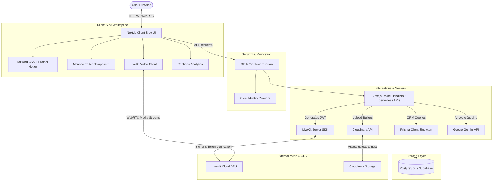

**How to read this diagram:** every request from the browser first hits Clerk's edge middleware before it is allowed to reach a route handler. From there, route handlers fan out to exactly one of four backends depending on the task: Postgres (via Prisma) for persisted state, LiveKit for real-time video tokens/media, Cloudinary for binary asset storage, or Gemini for AI judging. No route handler talks to more than one of these at a time except the contest-save flow, which only touches Postgres.

### 1.2 Why Serverless-First?

* **No idle compute cost** — route handlers spin up only on request, which matters for a platform with bursty traffic (contest start times, live session start times).
* **Stateless horizontal scale** — because nothing is kept in server memory between requests (see the Singleton Database Connection Pattern in §4.2), any number of function instances can serve traffic concurrently without coordination.
* **Managed edge distribution** — Next.js middleware and ISR pages are served from edge nodes close to the user, reducing latency for the largely read-heavy `/blogs` and `/leaderboard` routes.

### 1.3 Request Lifecycle (High Level)

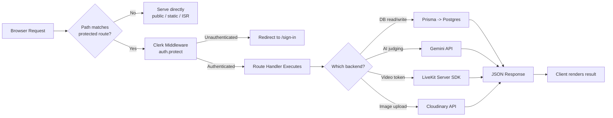

---

## 2. Core Modules & User Flows

CodeSaarthi has three primary modules that define the entire platform workflow:

| Module | Purpose | Primary Route(s) |
|---|---|---|
| **DSA Arena** | Timed algorithm contests, auto-judged by LLM | `/dsa`, `/contestdsa` |
| **Dev Arena** | Open-ended web/app/API build challenges, mentor-reviewed by LLM | `/dev`, `/contestdev` |
| **Live Cohorts** | Real-time video mentorship rooms | `/sessions`, `/sessions/[id]/room` |

### 2.1 Module Relationship Overview

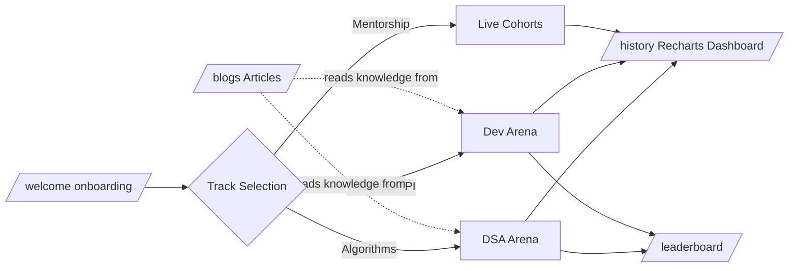

All three modules ultimately write into the same `history`/`leaderboard` surfaces, giving users one unified progress view regardless of which track they engage with.

### 2.2 DSA Practice & Evaluation Flow

Rather than spinning up sandboxed execution containers (Docker/Judge0/Piston), CodeSaarthi uses an **LLM-as-a-Judge** approach: the model reads the problem statement and the user's submitted code and reasons about correctness rather than literally executing it.

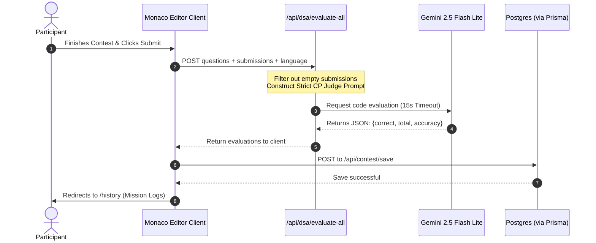

**Step-by-step explanation:**
1. The user works through problems in the Monaco editor, which is loaded client-side only (see §11.2).
2. On submit, the client bundles *all* question/submission pairs (not one request per problem) into a single POST to `/api/dsa/evaluate-all`, minimizing round trips.
3. The route handler strips out any question the user left blank — these are auto-scored as incorrect without spending an LLM call.
4. A tightly constrained "competitive-programming judge" prompt is built, instructing Gemini to return **only** structured JSON (`{correct, total, accuracy}`), never freeform prose.
5. The call to Gemini is wrapped in `Promise.race` against a 15-second timer; if Gemini doesn't respond in time, the handler falls back to a safe default rather than hanging the request (see §10.1).
6. Once the evaluation JSON is back, the client separately persists a `ContestAttempt` row and redirects the user to `/history`, where Recharts visualizes XP/accuracy trends over time.

### 2.3 Dev Arena Evaluation Flow (Kautilya Saarthi Mentor Persona)

For open-ended Web/App/API tasks there's no single "correct" output to pattern-match, so the platform uses a custom-prompted mentor persona — **Kautilya Saarthi** — that critiques structure and design quality instead of grading against a fixed answer key.

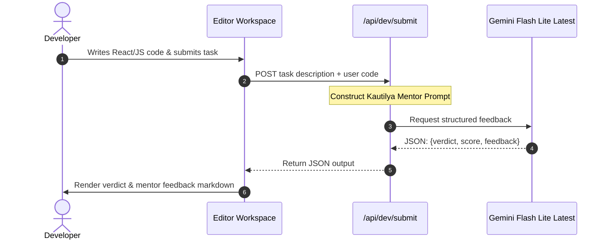

**Design intent:** notice that Kautilya's system prompt deliberately withholds the correct/idiomatic solution from the response — the persona is instructed to *never supply working code*, only structural and architectural feedback. This keeps the platform a learning tool rather than an autocomplete-the-assignment shortcut.

### 2.4 Live Cohorts (Mentorship) Flow

```mermaid
sequenceDiagram
    autonumber
    actor Host as Mentor (Host)
    actor Participant as Learner
    participant Admin as /admin/sessions
    participant API as /api/livekit/token
    participant SDK as LiveKit Server SDK
    participant SFU as LiveKit Cloud SFU

    Host->>Admin: Schedule LiveSession (title, time, room)
    Admin->>API: Create LiveSession row (status = scheduled)
    Note over API: At scheduled time, status flips to live
    Participant->>API: Requests join token for roomName
    API->>SDK: Generate signed JWT (identity, room grants)
    SDK-->>API: Return token
    API-->>Participant: Token delivered to client
    Participant->>SFU: Connect via WebRTC using token
    Host->>SFU: Connect via WebRTC using token
    SFU-->>Participant: Forward selected media streams
    SFU-->>Host: Forward selected media streams
```

This is the flow underlying the SFU architecture explained conceptually in §4.3 — this diagram shows *when* and *by whom* tokens are requested, while §4.3 explains *why* an SFU is used instead of P2P mesh.

---

## 3. Database Schema Design (Prisma)

The application uses **Prisma ORM** against a relational **PostgreSQL** database hosted on **Supabase**, indexed for fast lookups on user credentials (`userId`, `authorEmail`, `hostEmail` are all Clerk-issued identifiers, so no separate `User` table is needed — Clerk is the source of truth for identity).

### 3.1 Entity-Relationship Diagram

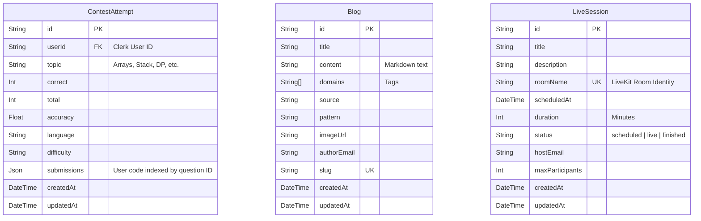

### 3.2 Table Notes

* **`ContestAttempt`** is intentionally denormalized: rather than a child table per submitted question, `submissions` is stored as a single `Json` blob keyed by question ID. This trades relational query flexibility (you can't easily `WHERE` on a single question's code) for write simplicity and read speed on the `/history` dashboard, which only ever needs the aggregate row, not per-question drill-down.
* **`Blog.slug`** is unique and used as the route param for `/blogs/[slug]`, giving human-readable, SEO-friendly URLs instead of raw IDs.
* **`LiveSession.roomName`** is unique and doubles as the LiveKit room identity — the same string is used both as a Postgres key and as the SFU room name, so there is exactly one source of truth for "which room is this."
* No table stores password hashes or session tokens — all of that is delegated entirely to Clerk (see §8), keeping the platform's own database free of sensitive auth data.

### 3.3 Data Flow: Who Writes to Which Table

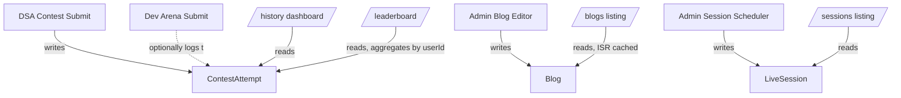

---

## 4. Key System Design Concepts Used

### 4.1 LLM-as-a-Judge Pattern

Traditional competitive-programming platforms execute submitted code inside isolated Docker containers (e.g. Judge0 or Piston). CodeSaarthi avoids that entirely:

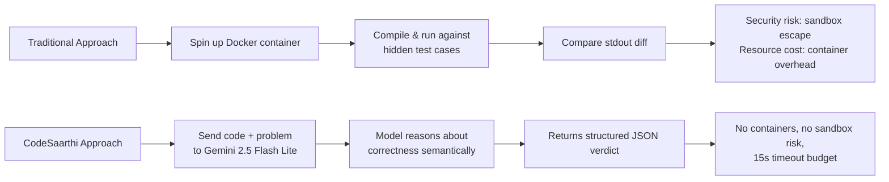

Trade-offs worth naming explicitly: this approach removes an entire class of infrastructure risk (container escapes, resource exhaustion, malicious code execution) at the cost of judging accuracy being bounded by the LLM's reasoning rather than ground-truth execution. The system compensates with a **strict, narrowly-scoped judge prompt** and a **parsing fallback that defaults to a `0` score** on any malformed or missing response, so failures are conservative rather than silently generous.

### 4.2 Singleton Database Connection Pattern

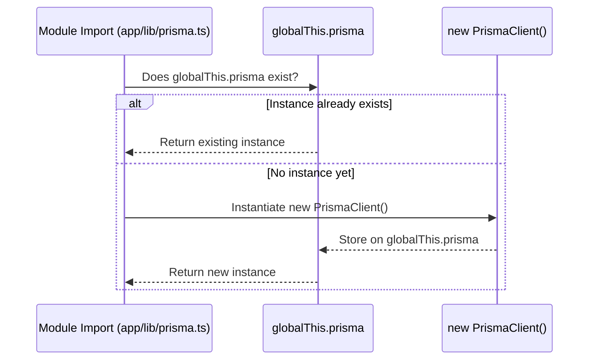

**Why this matters:** in serverless environments, each hot-reload during development (or each cold-start in production) re-runs module imports. Without this guard, every reload would spawn a fresh `PrismaClient`, and each client holds its own connection pool — quickly exhausting Postgres's max-connection limit under load. Pinning the instance to `globalThis` ensures at most one pool per running process.

### 4.3 Selective Forwarding Unit (SFU) Architecture

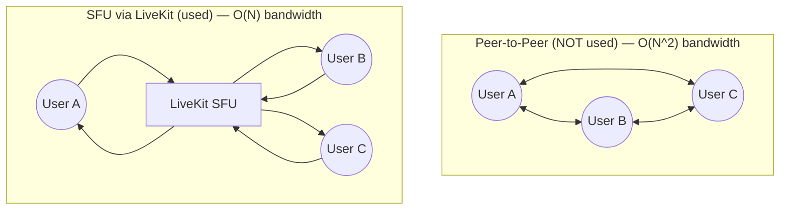

Each participant uploads exactly one stream to the SFU and receives only the streams the SFU selects to forward down, so bandwidth cost per client grows linearly with participant count instead of quadratically. Join tokens are minted server-side at `/api/livekit/token` using `livekit-server-sdk`, so raw API secrets never reach the browser — only a short-lived signed JWT does.

### 4.4 Route Guard Middleware Architecture

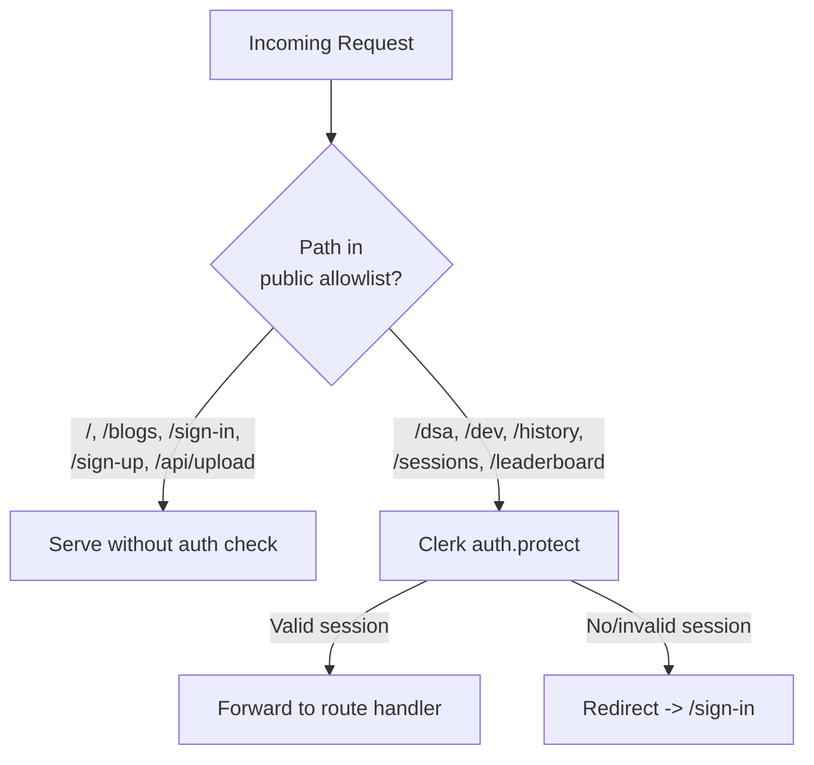

Security is handled once, centrally, at the Edge Middleware layer — individual pages and API routes don't need to re-implement their own auth checks, which removes an entire category of "forgot to guard this route" bugs.

### 4.5 Cloud Image Pipe & CDN Hosting

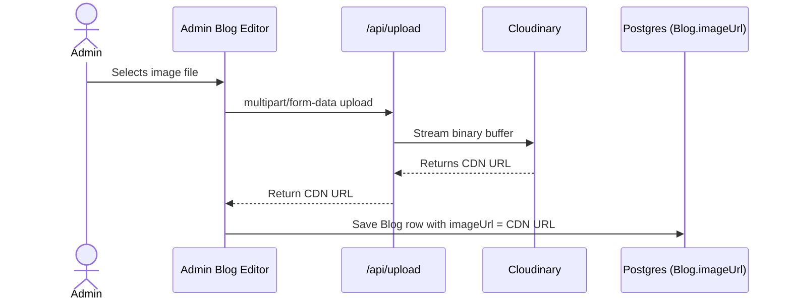

Only a lightweight string (the CDN URL) is ever stored in Postgres — the actual binary bytes never touch the application database, keeping row sizes small and read queries on `Blog` fast.

---

## 5. Directory & Routing Architecture

```
├── app/
│   ├── layout.tsx             # Root layout wraps ClerkProvider
│   ├── page.tsx               # Landing page with GSAP animations
│   ├── middleware.ts          # Clerk route-guard middleware
│   ├── welcome/               # Track Selection onboarding page
│   │
│   ├── dsa/                   # Configures topics & launch parameters
│   ├── contestdsa/            # Monaco editor + Problem statement workspace
│   │
│   ├── dev/                   # Configures Web/App/API tracks
│   ├── contestdev/            # Monaco workspace + Kautilya Saarthi responses
│   │
│   ├── blogs/                 # Technical articles list (mode: ISR/Static)
│   ├── admin/
│   │   ├── blog/              # Create and edit articles (Admin restricted)
│   │   └── sessions/          # Schedule/manage mentoring sessions
│   │
│   ├── sessions/              # View and join video rooms
│   │   └── [id]/room/         # LiveKit WebRTC Video conferencing view
│   │
│   ├── leaderboard/           # Leaderboard aggregates rankings (grouped by userId)
│   ├── history/               # Recharts dashboard visualizing XP & accuracies
│   │
│   └── api/                   # Serverless Endpoints
│       ├── dsa/               # evaluate-all, generate, submit handlers
│       ├── dev/                # generate, submit handlers
│       ├── livekit/           # token generator
│       └── upload/            # Cloudinary image pipeline
```

### 5.1 Route Map Visualized

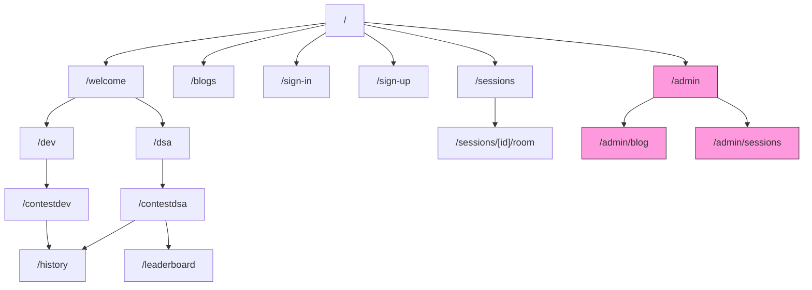

*(Pink nodes indicate admin-restricted routes, gated by an additional role check on top of the base Clerk authentication.)*

---

## 6. Component & State Architecture

### 6.1 Client Component Tree (Contest Workspace Example)

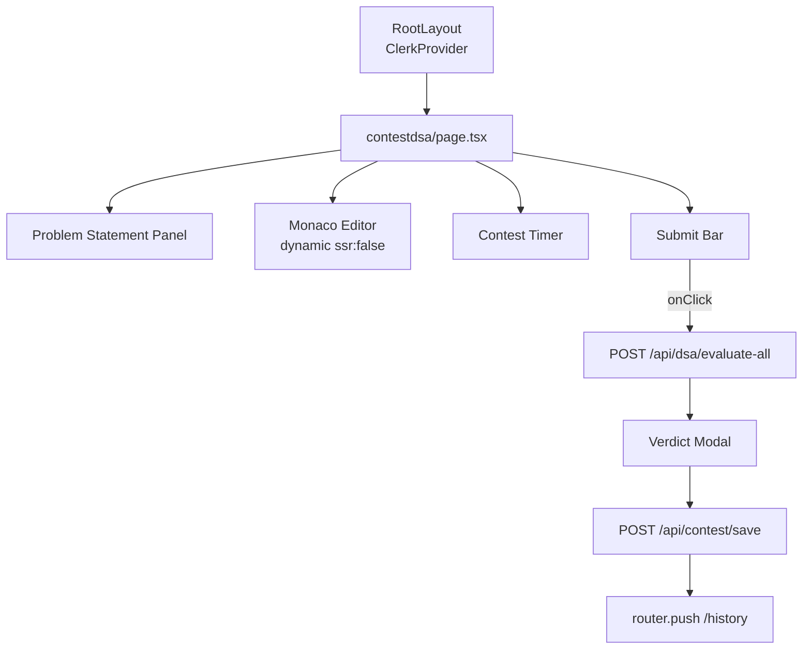

### 6.2 Client-Side State Flow

State is kept intentionally simple and local rather than introducing a global store (Redux/Zustand), since each workspace page is a largely self-contained flow:

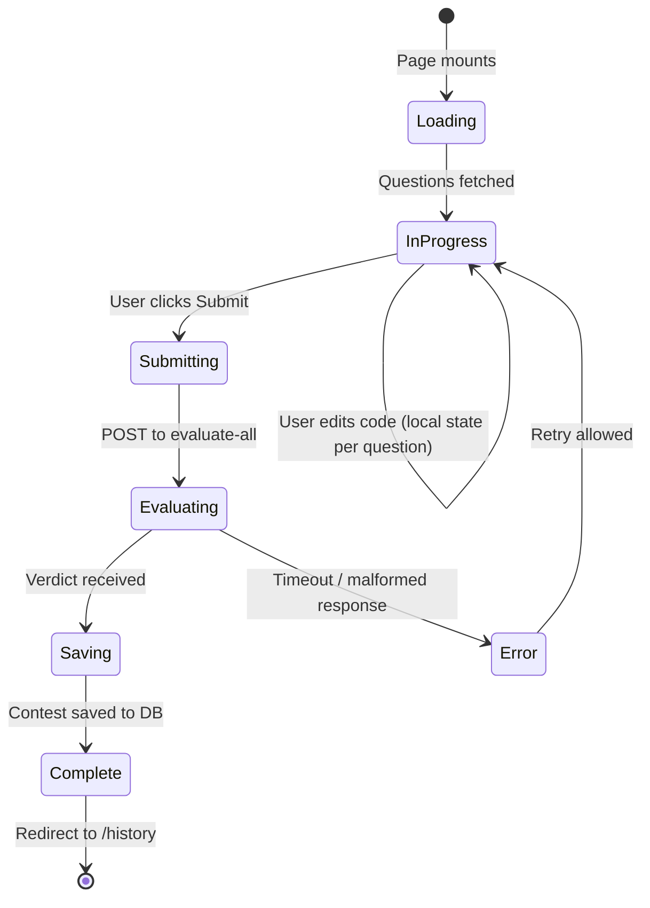

---

## 7. API Surface Reference

| Endpoint | Method | Purpose | Backend Touched |
|---|---|---|---|
| `/api/dsa/generate` | POST | Generate a fresh set of DSA problems for a topic/difficulty | Gemini |
| `/api/dsa/evaluate-all` | POST | Judge all submitted DSA solutions in one batch | Gemini |
| `/api/dsa/submit` | POST | Persist an individual submission record | Prisma → Postgres |
| `/api/dev/generate` | POST | Generate a Dev Arena challenge brief | Gemini |
| `/api/dev/submit` | POST | Get Kautilya Saarthi mentor feedback on submitted code | Gemini |
| `/api/contest/save` | POST | Persist a completed `ContestAttempt` row | Prisma → Postgres |
| `/api/livekit/token` | POST | Mint a signed join token for a LiveKit room | LiveKit Server SDK |
| `/api/upload` | POST | Upload an image and receive back a CDN URL | Cloudinary |

### 7.1 Endpoint Interaction Overview

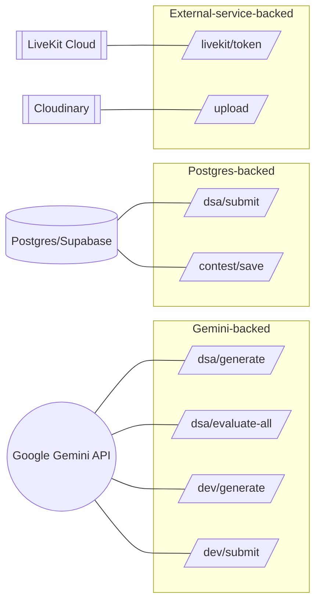

---

## 8. Authentication & Authorization Flow

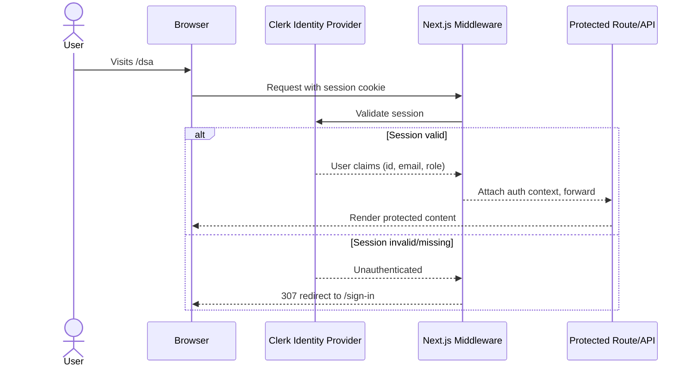

Role-based checks (e.g. for `/admin/*`) layer on top of the base Clerk session check: the middleware confirms *who* the user is, and the admin route handlers separately confirm *whether that identity is allow-listed* as an administrator before permitting writes to `Blog` or `LiveSession`.

---

## 9. Deployment & Infrastructure Topology

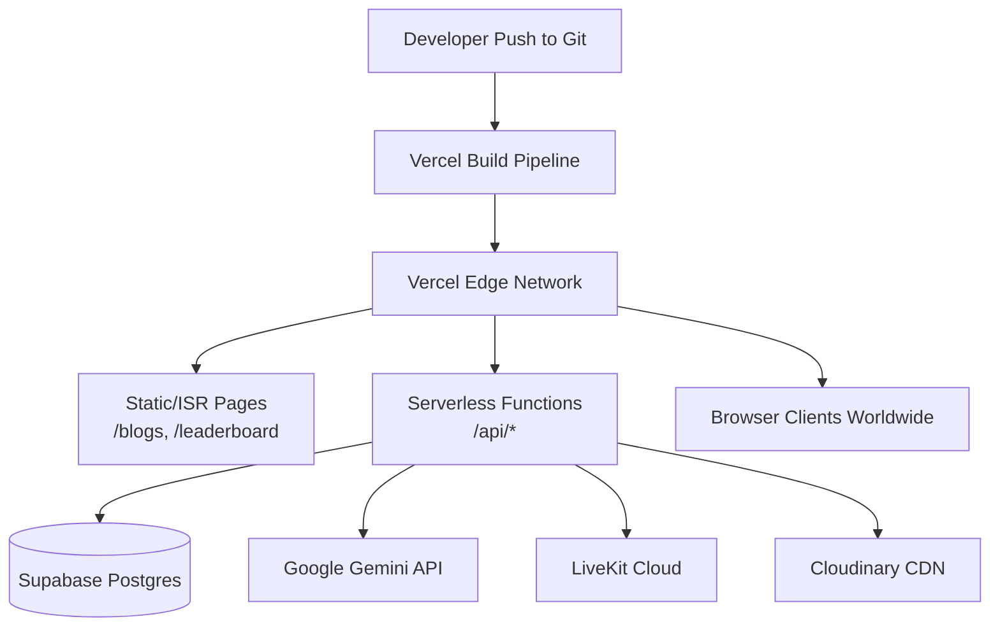

The entire application deploys as a single Vercel project. There is no separately managed application server: Postgres (Supabase), video (LiveKit Cloud), storage (Cloudinary), and AI (Gemini) are all managed third-party services reached over HTTPS from within serverless functions, which is what allows the "Serverless-First" claim in §1 to hold end-to-end — there is no stateful process anywhere in the stack that CodeSaarthi's own team has to patch or scale manually.

---

## 10. Error Handling & Resilience

### 10.1 Gemini Timeout & Fallback Path

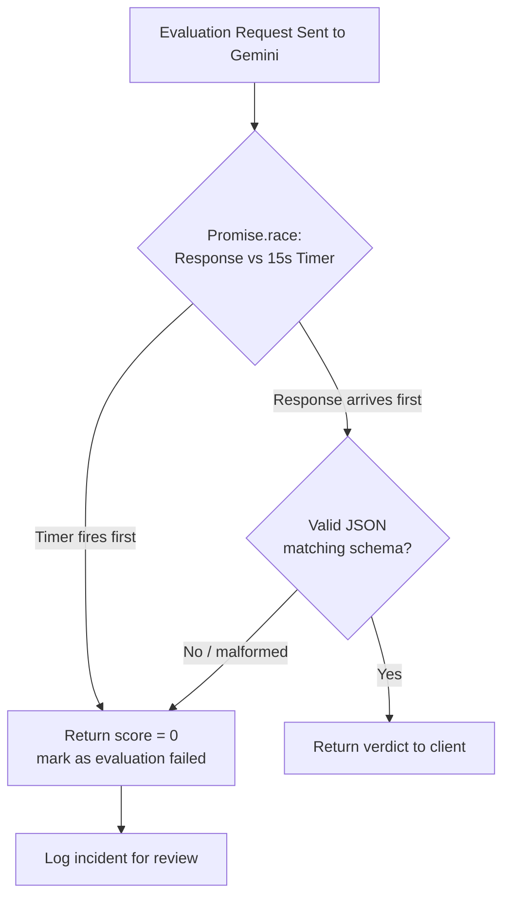

This is a deliberately **conservative failure mode**: rather than retrying indefinitely (which risks the user staring at a spinner) or guessing a passing score (which would be exploitable), any judging failure resolves to the lowest possible score plus a logged incident, and the UI is expected to clearly label these as "evaluation failed" rather than a genuine `0/N` performance.

### 10.2 Empty Submission Filtering

Before any Gemini call is made, `/api/dsa/evaluate-all` strips out questions the user left completely blank, scoring them as incorrect locally. This avoids spending LLM quota/latency judging nothing, and also avoids the (small but real) risk of a model hallucinating a "correct" verdict for an empty answer.

---

## 11. Performance & Optimization Strategy

1. **Incremental Static Regeneration (ISR)** — `/blogs` and `/leaderboard` use `revalidate = 60`, so most requests are served from Vercel's edge cache instead of hitting Postgres on every page load; the underlying data is at most 60 seconds stale.
2. **Dynamic Imports (No SSR)** — `Monaco Editor` and `VideoRoom` depend on browser globals (`window`, `navigator`, `navigator.mediaDevices`) that don't exist during server rendering. Both are loaded via `dynamic(() => import(...), { ssr: false })`, avoiding build failures and unnecessary server compute spent server-rendering components that will be replaced on hydration anyway.
3. **Optimized Animation Pipeline** — the landing page's GSAP ScrollTrigger animations check `prefersReducedMotion()` before running, saving CPU cycles and respecting accessibility preferences for motion-sensitive users.
4. **Batched AI Calls** — as shown in §2.2, DSA evaluation batches every question into a single Gemini request rather than one call per question, reducing both latency (fewer round trips) and cost (fewer API calls billed).

```mermaid
graph LR
    A["ISR (revalidate=60)"] --> D["Fewer DB round trips"]
    B["Dynamic ssr:false imports"] --> E["Faster server render, no build errors"]
    C["Batched Gemini calls"] --> F["Lower latency + lower API cost"]
    G["prefersReducedMotion check"] --> H["Accessible, CPU-friendly animations"]
```

---

## 12. Security Considerations

* **No secrets in the client bundle** — Gemini API keys, LiveKit API secret, Cloudinary API secret, and the Postgres connection string all live server-side only, referenced from route handlers and never exposed to `NEXT_PUBLIC_*` environment variables.
* **Short-lived, scoped LiveKit tokens** — join tokens are generated per-request with room-specific grants rather than a long-lived static credential, limiting the blast radius if a token leaks.
* **Centralized auth gate** — because route protection lives in one middleware file (§4.4) rather than scattered per-page checks, there's a single place to audit for auth coverage gaps.
* **LLM output is treated as untrusted input** — Gemini's JSON responses are parsed defensively with a fallback path (§10.1) rather than trusted blindly, since a malformed or unexpected model response should never crash a route handler or silently corrupt a `ContestAttempt` row.
* **Public route allowlist is explicit, not inferred** — `/`, `/blogs`, `/sign-in`, `/sign-up`, `/api/upload` are the *only* paths excluded from the auth gate; everything else defaults to protected, which is the safer default direction for a route guard to fail toward.

---

## 13. Future Scaling Roadmap

Points worth flagging for a team growing beyond the current design:

* **`ContestAttempt.submissions` as JSON** works well at current scale but will make per-question analytics (e.g. "which problems have the lowest pass rate") expensive once the table is large, since it requires JSON parsing at query time rather than indexed columns. A future migration could normalize this into a child `Submission` table if that analytics need materializes.
* **LLM-as-a-Judge accuracy ceiling** — as contest difficulty grows, semantic judging without actual execution may need to be supplemented with a lightweight sandboxed execution path for problems where exact output-matching matters more than structural reasoning (e.g. strict Big-O/performance-sensitive problems).
* **Admin role storage** — if the admin allowlist is currently a hardcoded email list, migrating it into Clerk's native role/metadata system would let admin management happen without a code deploy.
* **Rate limiting on Gemini-backed routes** — batching helps cost, but as user count grows, per-user rate limiting on `/api/dsa/evaluate-all` and `/api/dev/submit` will likely be needed to prevent quota exhaustion from a small number of high-frequency users.

```mermaid
graph TD
    Now[Current Design] --> R1[Normalize submissions<br/>into child table]
    Now --> R2["Hybrid judge: LLM + sandboxed exec for<br/>perf-sensitive problems"]
    Now --> R3[Move admin roles<br/>into Clerk metadata]
    Now --> R4[Add per-user rate limiting<br/>on Gemini-backed routes]
```

---

*End of document.*

